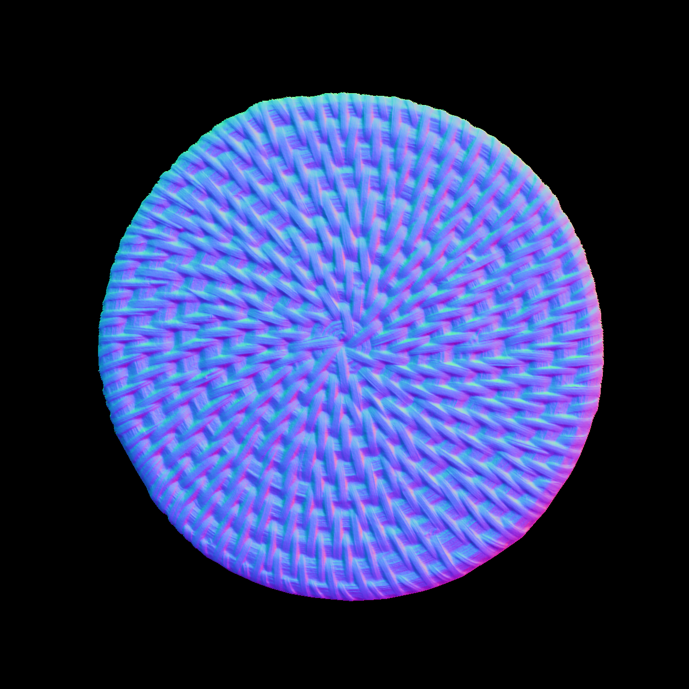
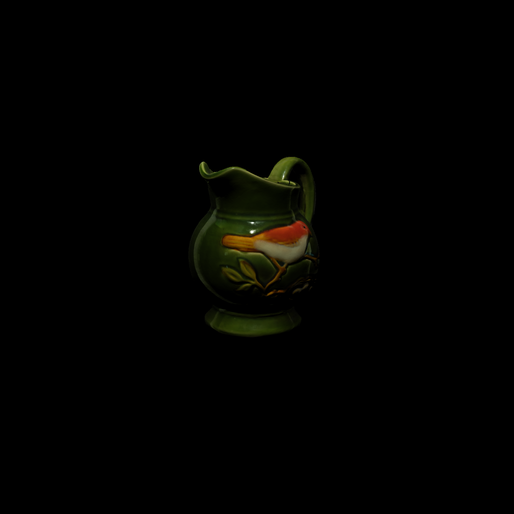
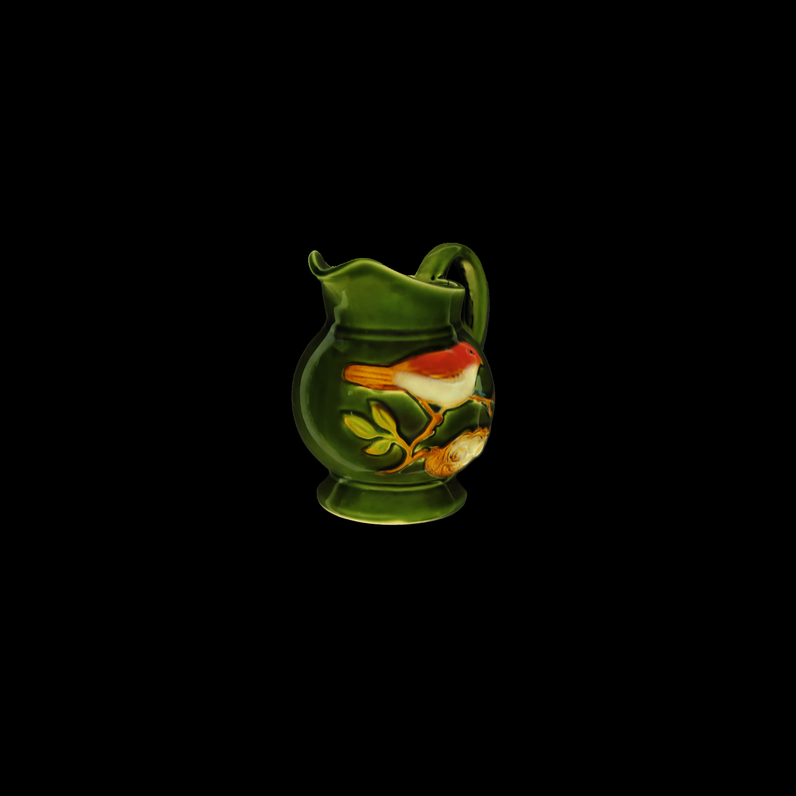

# SCPS-Hash
# Self-calibrating Photometric Stereo with Hash encoding

### Results on User dataset
<p align="center">
    
    
    
    
    
    
</p>

## Use your own dataset
Prepare your Photometric Stereo images and a mask image to data/User/{yourdata}

## Train from Scratch
First, initialize light estimations.
```
python lights_initialize.py --config configs/User/{yourdata}.yml
```

Then, train from scatch.
```
python train.py --config configs/User/{yourdata}.yml
```
